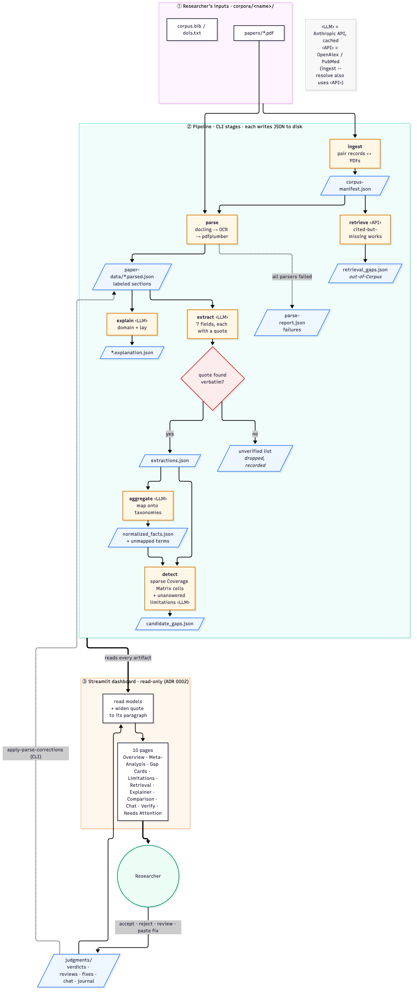
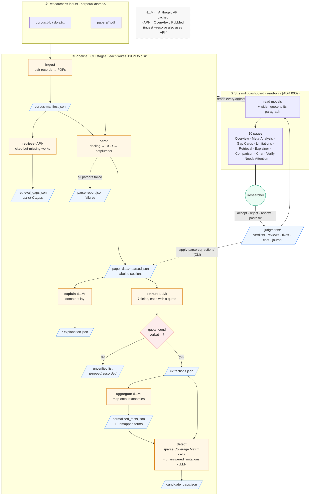
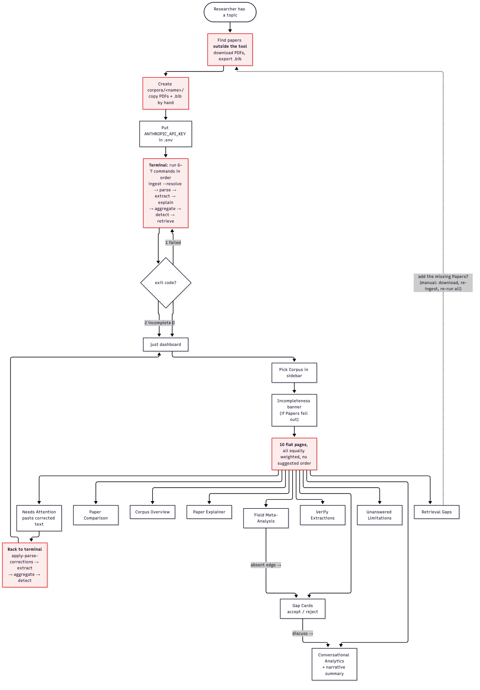
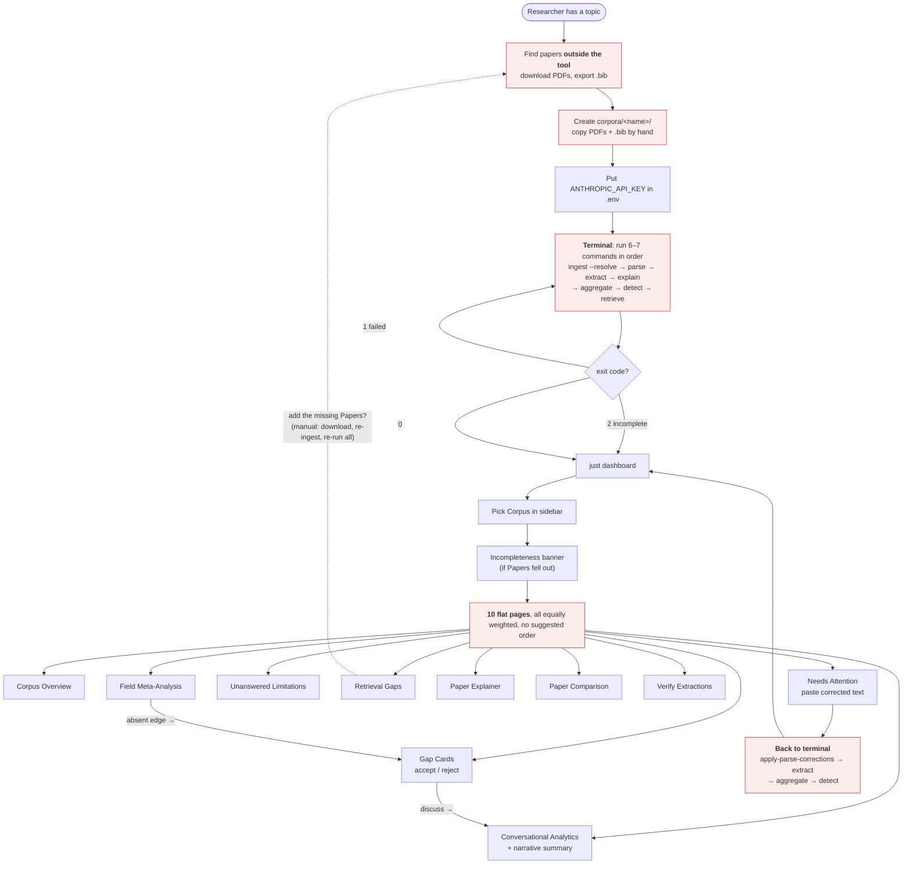
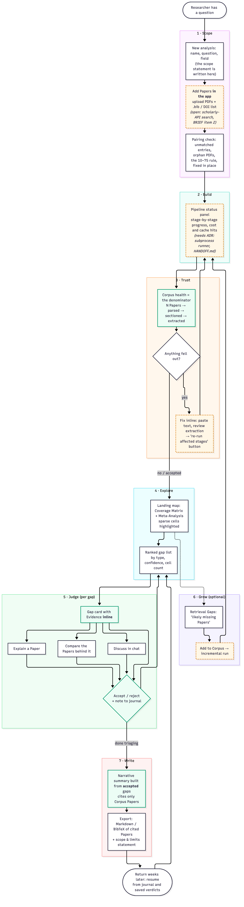
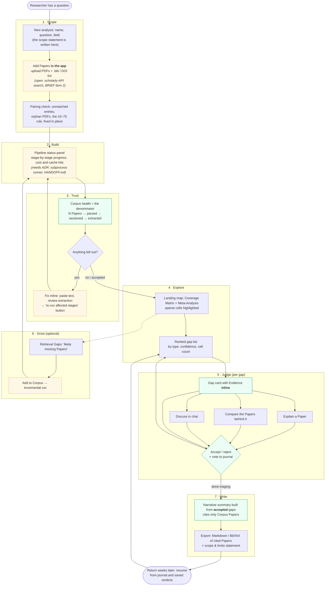

# Journeys: data and user

Three diagrams. The PNGs live in `docs/diagrams/`, rendered from the Mermaid source kept under each image:

1. **Data journey**: how one Paper becomes something the researcher sees.
2. **User experience as it is today**: built from the code, `docs/FUNCTIONALITY.md` and `docs/HANDOFF.md`.
3. **User experience as it should be**: a proposal. Parts marked *(needs ADR)* or
   *(open)* conflict with an accepted ADR or with an open item in `docs/BRIEF.md`.

---

## 1. Data journey: from Paper to user

Mermaid source

**What the diagram shows**

- Every arrow between stages passes through a JSON file on disk. The disk is
  the state; nothing is kept in a database or a long-running process.
- The Evidence passage is the thread that runs the whole way through. It is
  quoted at **extract**, checked at the gate, carried through **aggregate** and
  **detect**, and widened back to its paragraph when the dashboard shows it.
- Papers drop out at three points: parse failure, zero verified facts, and
  dropped facts. Each one is written down (`parse-report.json`, the
  `unverified` list) and shown on Needs Attention, so nothing is lost silently.
- The dashboard writes only to `judgments/`. Corrections reach the pipeline
  only when someone runs a CLI command.

---

## 2. User experience today

Mermaid source

**Where it hurts** (red nodes)

| # | Pain point | Why it matters |
|---|---|---|
| 1 | Finding papers and building the corpus happen outside the tool | The scope ("what was searched") is never recorded, but the Brief requires the dashboard to state it. |
| 2 | The pipeline only runs from the terminal | Researchers are not CLI users, and the dashboard can only say "run `detect` first" (`HANDOFF.md`). |
| 3 | 10 pages with the same weight and no order | Nothing separates "check the corpus first" from "explore" and "write up". Verify and Needs Attention sit at the bottom, though they decide whether the rest can be trusted. |
| 4 | Fixing anything sends you back to the terminal | A pasted correction does nothing until someone runs three CLI commands and reloads. |
| 5 | Retrieval Gaps lead nowhere | The tool suggests missing Papers, but adding one means restarting the whole loop by hand. |
| 6 | Accepting a gap has no effect later on | Verdicts are saved, but the narrative summary and later visits don't build on them in an obvious way. |

---

## 3. User experience as it should be (proposal)

The idea: one guided path that follows a researcher's real task (*scope → trust →
explore → judge → write*). The specialist pages stay, but as tools you reach
from a gap or a Paper, not as the main navigation.

Mermaid source

**Today vs. proposed**

| Step | Today | Should be | Blocker / decision needed |
|---|---|---|---|
| Scope | Not recorded | Written at the start, shown on every page | Small; fits the Brief's "states its own scope" rule |
| Add Papers | Copy files by hand | Upload in the app | Writing to `papers/` from the UI: ADR 0002 refinement |
| Build | Terminal, 6–7 commands | Status panel with run buttons | **New ADR**: subprocess runner keeps the "imports no pipeline" rule (see `HANDOFF.md`) |
| Trust | Banner + a page at the bottom of the nav | Required checkpoint before exploring, showing the denominator | None: reorders existing pages |
| Explore | 10 flat pages | Map → ranked list | None: navigation only |
| Judge | Gap Cards + cross-page jumps | One card that opens Explainer, Comparison and Chat in context | None |
| Grow | Dead end | Add a suggested Paper → incremental run | Needs the runner ADR + ingest from the UI |
| Write | Summary covers all gaps | Summary covers **accepted** gaps; export | Small: read `judgments/` in `analytics.py` |
| Return | Verdicts persist, no resume point | Resume from journal | Small |

**Navigation decided (prototype verdict, 2026-10-04):** a home screen with a
phase-grouped sidebar (prototype variant B), plus a step bar on every page,
numbered sidebar items, Previous/Next buttons, a status-driven "Recommended
next step", and a **soft Trust gate** (later steps unlock once fallout is fixed
or the denominator is acknowledged). Full verdict: `prototypes/VERDICT.md` on
the `prototype/guided-flow` branch.

Green nodes already exist and only need to move into the main path. Dashed
amber nodes cross the ADR 0002/0006 read-only boundary and need an ADR
decision first (`/skill:domain-modeling`).
